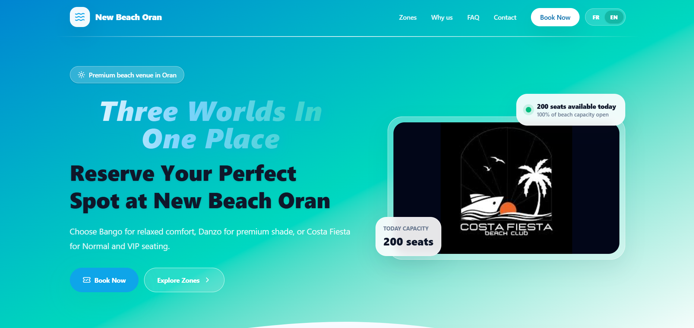
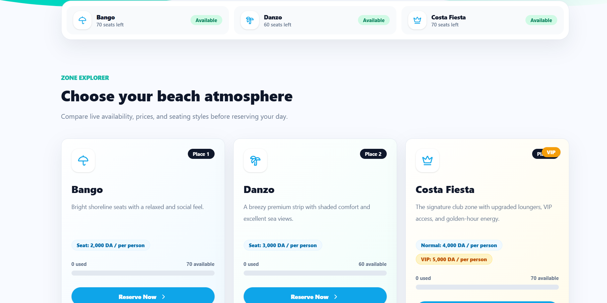
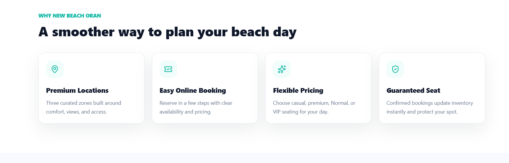

### Three worlds in one place. Reserve your perfect beach spot online.
 
 

&nbsp;

 
  
 

 
<a href="#-preview">Preview</a> ·
<a href="#-features">Features</a> ·
<a href="#-the-three-zones">Zones</a> ·
<a href="#-how-it-works">How it works</a> ·
<a href="#-tech-stack">Tech stack</a> ·
<a href="#-run-it-locally">Run locally</a>
 

 
## 📸 Preview
 

  

<table>
  <tr>
    <td width="50%"></td>
    <td width="50%"></td>
  </tr>
  <tr>
    <td align="center"><b>Zone explorer</b> with live availability</td>
    <td align="center"><b>Why New Beach Oran</b></td>
  </tr>
</table>
 
## ✨ Features
 
| | |
|---|---|
| 📅 **Easy online booking** | Reserve in a few clear steps, solo or for a whole group |
| 📊 **Live availability** | Used and remaining seats update per zone in real time |
| 🛡️ **Guaranteed seat** | A confirmed booking updates the inventory instantly and protects your spot |
| 🔔 **Booking notifications** | The venue is notified as soon as a new booking comes in |
| 🌍 **Bilingual** | Full French and English interface with a one-click switch |
| 📱 **Installable app** | Add it to your phone's home screen, with an offline page |
| 💵 **Cash payment** | Pay on arrival, with no online payment needed |
| 🚫 **No on-site queues** | No more reservations at the entrance |
 
 
## 🌊 The three zones
 
| Zone | Atmosphere |
|------|------------|
| ☂️ **Bango** | Bright shoreline seats with a relaxed and social feel |
| 🌴 **Danzo** | A breezy premium strip with shaded comfort and excellent sea views |
| 👑 **Costa Fiesta** | The signature club zone: upgraded loungers, VIP access and golden-hour energy |
 
The venue offers **200 seats per day** across the three zones.
 
 
## 🧭 How it works
 
1. 🏝️ **Pick a zone** that matches your mood
2. 🪑 **Choose your seats** for yourself or for a group
3. 📝 **Enter your details** and move through the booking steps
4. 💵 **Choose cash payment** and confirm
5. ✅ **Show up and enjoy**, your seat is guaranteed
 
## 🧰 Tech stack
 
| | |
|---|---|
| **Front-end** | React · JavaScript · CSS |
| **Build tool** | Vite |
| **App features** | Web app manifest · service worker · offline page |
| **Hosting** | GitHub Pages |
 

  
 
## 🔭 Roadmap
 
- [x] Zone explorer with live availability
- [x] French and English interface
- [x] Installable web app with offline page
- [x] Booking notifications
- [ ] Online payment
- [ ] Admin dashboard
 
## 👩‍💻 Author
 
**Assia Yacine**, Computer Science student, Oran, Algeria
 

&nbsp;

 

 
